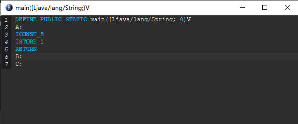

# 第二章--初识Recaf

## 1.Recaf是什么？

Recaf是一个开源Java字节码编辑器，Recaf大大降低了编辑Java字节码的难度。 诸如更新帧栈之类的困难任务都是自动完成的。 

 
## 2.下载Recaf

https://github.com/Col-E/Recaf

 
## 3.配置Recaf：

Class Mode改为Table，这样打开每个Class默认采用表格模式读取（只有表格模式可以进行Java字节码编辑)

 

修改保存修改的快捷键，随便你改啥，因为Ctrl+S有的时候会被其他应用程序占用TAT

 

关掉Use existing data,这个功能有可能被crasher干扰，其他的默认

 

临时切换反编译/表格/16进制码模式的方法如图

 

## 4.使用Recaf:

（模式：Table表格模式）：

Class选项卡显示的是选中的类的属性

Fields字段（即成员变量）选项卡为空，因为在这个类中没有定义成员变量

Methods方法（即成员函数)选项卡如下

将鼠标指针放到Access列的图标上可以获取对应的方法的访问许可（public、static等)

Return即方法返回值类型

Name列即方法的名称

Arguments是方法需要的参数

右键方法即可进行Remove(删除方法)、search reference(找出引用此方法的)、Rename(重命名方法)、Edit with assembler("编辑汇编代码")

